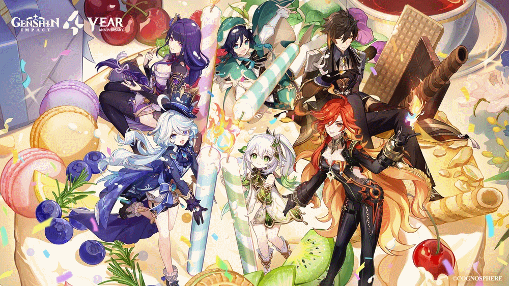

# Genshin Impact Wish Simulator

{width="1000"}

Genshin Impact is an open-world RPG where you can explore the nations, play throughout the overarching story, and master the games combat through the combinations of different elements and their reactions toward each other. This is a program designed to replicate/simulate the wishing/gacha system used in order to get more characters and weapons.

## The Wishing System

[{width="900"}](https://keqingmains.com/qiqi/)

### Character Event Wish

#### 5 Star Character Probabilities

{width="800"}

|                         |           |
|:-----------------------:|:---------:|
|          Item           | Base Rate |
|    5 Star Character     |   0.6%    |
| 4 Star Character/Weapon |   5.1%    |
|      3 Star Weapon      |   94.3%   |

-   5 Star Characters have a 0.6% base rate of being pulled.
    -   If a 5 Star Character is not pulled by the 90th wish, the 90th wish is *guaranteed* to be a 5 Star Character.
        -   Anytime a 5 Star Character is received, this counter, known as *pity* will reset. *Pity* is carried across banners.
    -   Everytime a 5 Star Character is received, there is a 50% chance of the character being a *Standard 5 Star Character* or the *Promotional 5 Star Character.*
        -   If the player previously *did not* obtain the *Promotional 5 Star Character* when they received a 5 Star Character, then they are *guaranteed* to obtain the *Promotional 5 Star Character* next time a 5 Star Character is received*. Gurantees* are carried across banners.
        -   If the player *did* obtain the *Promotional 5 Star Character* when they received a 5 Star Character, then the 50%/50% roll occurs.
        -   Regardless if the player receives the *Promotional 5 Star Character* from winning the 50%/50% roll or from being *guaranteed,* they will always have to do the 50%/50% the next time a 5 Star Character is received.
    -   Upon failing to receive a *Promotional 5 Star Character* on the 50%/50% roll, there may be a chance to trigger *Capturing Radiance*.
        -   Upon trigger *Capturing Radiance*, then the *Promotional 5 Star Character* is received.

#### 4 Star Character Probabilities

### Event Weapon Wish

#### 5 Star Weapon Probabilities

-   Weapon Banner has yet to be implemented.

#### 4 Star Weapon Probabilities